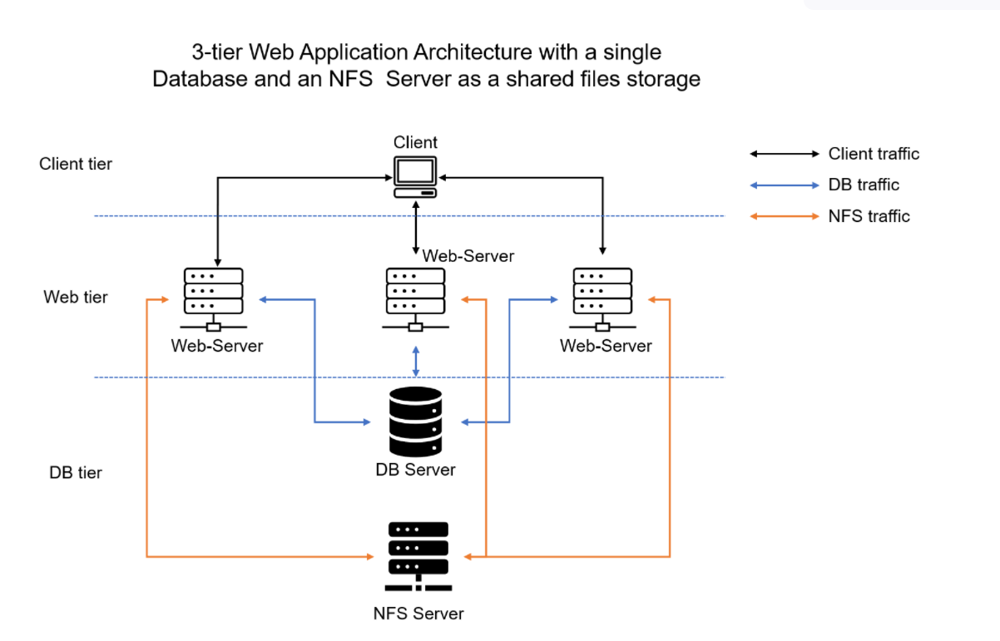
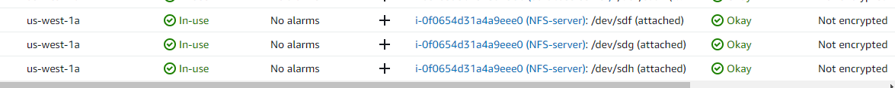
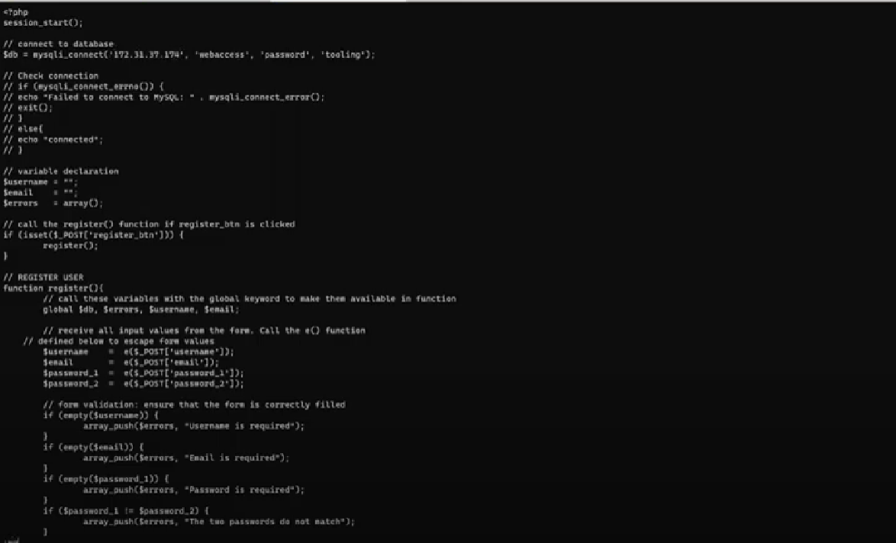
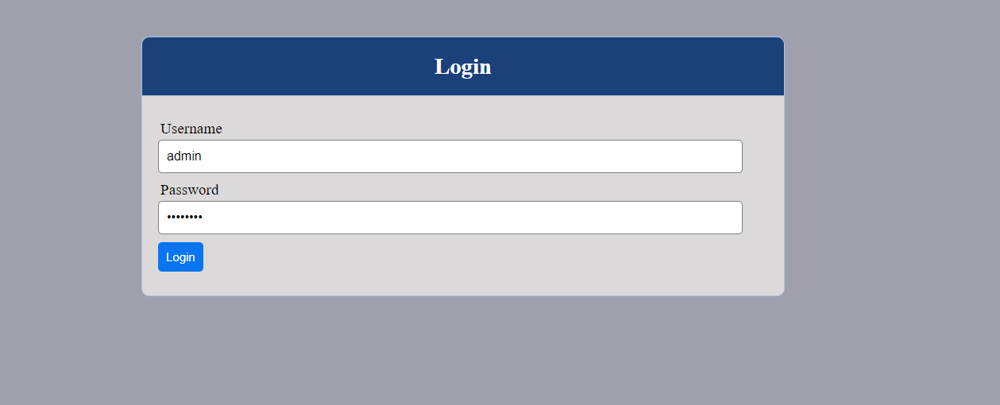
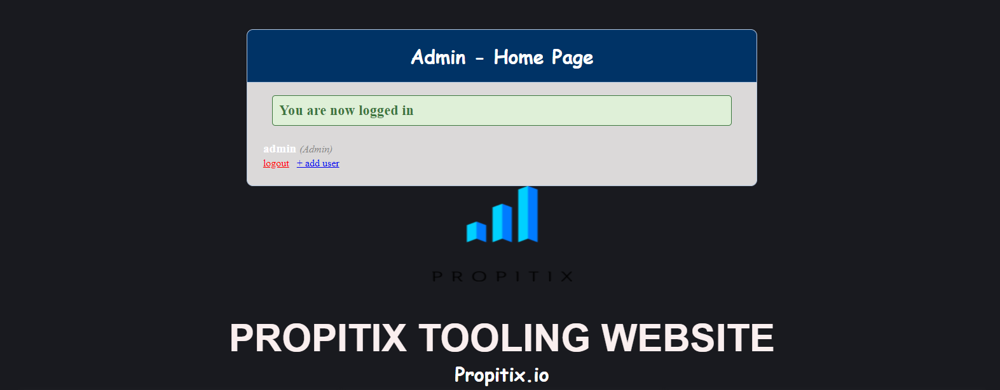
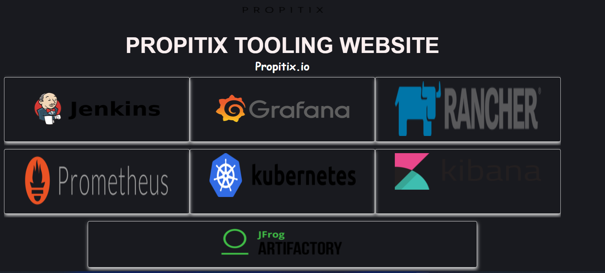

# Documentation for project 7

**In this project you will implement a solution that consists of following components:**

1. Infrastructure: AWS
2. Webserver Linux: Red Hat Enterprise Linux 8
3. Database Server: Ubuntu 20.04 + MySQL
4. Storage Server: Red Hat Enterprise Linux 8 + NFS Serve
5. Programming Language: PHP
6. Code Repository: GitHub

** 3 tier Web Application Architecture with a single Database and an NFS Server as a shared files storage**

### STEP 1 – PREPARE NFS SERVER

1. Set up RHEL EC2 instance NFS Server

2. create EBS volume and attche to newly created NFS server

**check for disk**

`lsblk`

**start partition**

`sudo gdisk`

**check disk partition**

`lsblk`

**install lvm2 package**

`sudo yum install lvm2 -y`

**run a disk scan**

`sudo lvmdiskscan`

**create PV**

`sudo pvcreate`

**check**

`sudo pvs`

**create VG name vg-webdata**

`sudo vgcreate`

**create LV for apps. logs, opt**

`sudo lvcreate -n lv-apps -L 9G vg-webdata`

`sudo lvcreate -n lv-logs -L 9G vg-webdata`

`sudo lvcreate -n lv-opt -L 9G vg-webdata`

**check**

`sudo lvs `
`sudo vgs `
`sudo pvs `
`lsblk `

**format the disk as xfs for apps, loga, and opt**

`sudo mkfs xfs /dev/vg-webdata/lv-apps`

`sudo mkfs xfs /dev/vg-webdata/lv-logs`

`sudo mkfs xfs /dev/vg-webdata/lv-opt`

**create mount points on /mnt directory for logical volumes lv-apps, lv-logs, and lv-opt and mount on /mnt/apps /mnt/logs /mnt/opt**

`sudo mkdir mnt/apps`

`sudo mkdir mnt/logs`

`sudo mkdir mnt/opt`

**Update your NFS Server and run the following command**

`sudo yum update -y`

`sudo yum install nfs-utils -y`

`sudo systemctl start nfs-server.service`

`sudo systemctl enable nfs-server.service`

`sudo systemctl status nfs-server.service`

**Make sure we set up permission that will allow our Web servers to read, write and execute files on NFS**

`sudo chown -R nobody: /mnt/apps`

`sudo chown -R nobody: /mnt/log`

`sudo chown -R nobody: /mnt/opt`

`sudo chmod -R 777 /mnt/apps`

`sudo chmod -R 777 /mnt/log`

`sudo chmod -R 777 /mnt/opt`

`sudo systemctl restart nfs-server.service`

**Configure access to NFS for clients within the same subnet (example of Subnet CIDR – 172.31.32.0/20 )**

`sudo vi /etc/exports`

**exportfs**

`sudo exportfs -arv`

**Check which port is used by NFS and open it using Security Groups (add new Inbound Rule)**

`rpcinfo -p | grep nfs`

**Important note: In order for NFS server to be accessible from your client, you must also open following ports: TCP 111, UDP 111, UDP 2049**

# STEP 2 — CONFIGURE THE DATABASE SERVER

**create an ubuntu server for mysql database and configure it**

`sudo apt update`

`sudo apt upgrade`

`sudo yum install mysql-server -y`

1. Create a database and name it tooling
2. Create a database user and name it webaccess
3. Grant permission to webaccess user on tooling database to do     anything only from the webservers subnet cidr

`sudo mysql`

**create database with the name 'tooling', create user with the name 'webaccess', grant psermission to user 'webaccess' on 'tooling' database and finally flush privileges**

**show databases and use tooling**

# Step 3 — Prepare the Web Servers

**We need to make sure that our Web Servers can serve the same content from shared storage solutions, in our case – NFS Server and MySQL database.**

**You already know that one DB can be accessed for reads and writes by multiple clients. For storing shared files that our Web Servers will use – we will utilize NFS and mount previously created Logical Volume lv-apps to the folder where Apache stores files to be served to the users (/var/www).**

**This approach will make our Web Servers stateless, which means we will be able to add new ones or remove them whenever we need, and the integrity of the data (in the database and on NFS) will be preserved.**

*During the next steps we will do following*

- Configure NFS client
- Deploy a Tooling application to our Web Servers into a shared NFS folder
- Configure the Web Servers to work with a single MySQL database.

**Launch a new EC2 instance with RHEL 8 Operating System**

**update the instance**

`sudo yum update`

**Install NFS client**

`sudo yum install nfs-utils nfs4-acl-tools -y`

**Mount /var/www/ and target the NFS server’s export for apps**

`sudo mkdir /var/www`

**insert NFS private IP Address**

`sudo mount -t nfs -o rw,nosuid <NFS-Server-Private-IP-Address>:/mnt/apps /var/www`

**Verify that NFS was mounted successfully by running df -h**

`df -h`

**Make sure that the changes will persist on Web Server after reboot**

`sudo vi /etc/fstab`

**add the following line in the executed command above inserting the Private IP Address of the NFS-Server**

*<NFS-Server-Private-IP-Address>:/mnt/apps /var/www nfs defaults 0 0*

# Install Remi’s repository, Apache and PHP

`sudo yum install httpd -y`

`sudo dnf install https://dl.fedoraproject.org/pub/epel/epel-release-latest-8.noarch.rpm`

`sudo dnf install dnf-utils http://rpms.remirepo.net/enterprise/remi-release-8.rpm`

`sudo dnf module reset php`

`sudo dnf module enable php:remi-7.4`

`sudo dnf install php php-opcache php-gd php-curl php-mysqlnd`

`sudo systemctl start php-fpm`

`sudo systemctl enable php-fpm`

`sudo setsebool -P httpd_execmem 1`

**Locate the log folder for Apache on the Web Server and mount it to NFS server’s export for logs. Repeat step №4 to make sure the mount point will persist after reboot.**

*sudo mount -t nfs -o rw,nosuid <NFS-Server-Private-IP-Address>:/mnt/apps /var/www*

`sudo mount -t nfs -o rw,nosuid 172.31.12.222:/mnt/apps /var/log/httpd`

**Repeat step №4 to make sure the mount point will persist after reboot.**

`sudo vi /etc/fstab`

**Fork the tooling source code from Darey.io Github Account to your Github account.**

*but first install git in your web-server*

`sudo yum install git`

*initialize git*

`git init`

*NB*
**How to Fork in Github**

[fork in github](https://github.com/darey-io/tooling)

**run the following command**

`ls`

`cd tooling/`

**Still in your tooling directory Ensure that the html folder from the repository is deployed to /var/www/html**

`sudo cp -R html/. /var/www/html`

**Update the website’s configuration to connect to the database**

`sudo /var/www/html/functions.php`

*replace local with DB private IP addrr, admin to be 'webaccess' admin to be 'password' and 'tooling'

*Install mysql-client on the web-server*

`sudo yum install mysql -y`

*configure DB Security Group add new rule*

**change bind addresss of DB-server to 0.0.0.0**

`sudo vi /ect/mysql/mysql.conf.d/mysqld.cnf`

**Apply tooling-db.sql script to your database using this command on the webserver**

`mysql -h 172.31.9.70 -u webaccess -p tooling < tooling-db.sql`

**Go to your DB server**

`msql`

*run these commands*

`show databases`

`show tables`

`select * from table`

**webserver showing same admin and password as DB server**

`sudo vi tooling-db.sql`

**NOTE: Do not forget to open TCP port 80 on the Web Server.**

**NB: If you encounter 403 Error – check permissions to your /var/www/html folder and also disable SELinux sudo setenforce 0**

*To make this change permanent – open following config file sudo vi /etc/sysconfig/selinux and set SELINUX=disabledthen restrt httpd.*

`sudo vi /etc/sysconfig/selinux`
*NB: SELINUX=disabled*

*Open the website in your browser http://<Web-Server-Public-IP-Address-or-Public-DNS-Name>/index.php 
 make sure you can login into the websute with myuser user*

 *refersh the URL page*

 

 *enter user name: admin*
 *enter password:  admin*

 

 

 # YAAAAY! THAT CONCLUDES THIS PROJECT
 # THANK YOU.

